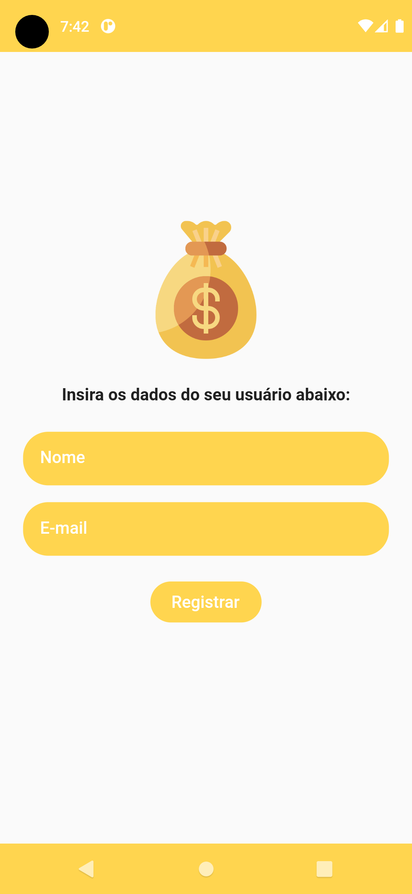
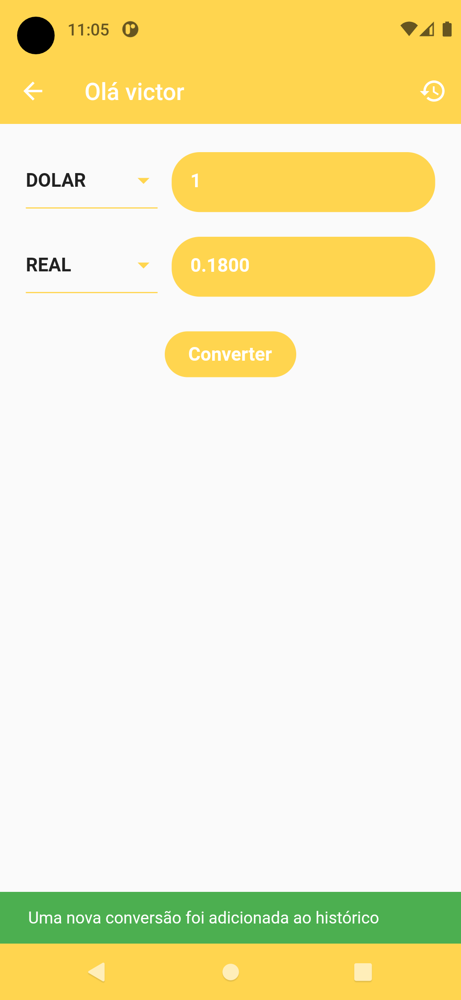

# Atividades Flutter 03

Atividades Flutter 03 - Disciplina PROGRAMAÇÃO DISPOSITIVOS MÓVEIS (2022.2)

Aplicativo de conversão de moedas (real, dolar, euro e bitcoin), feito usando clean-architecture e controllers para UI.

  
  
  
  

### Features adicionais (11/10/2022):

- Registra o usuário logado usando a dependência shared_preferences, convertendo a classe UserEntity para um HashMap e depois para uma string JSON;
- Preenche o formulário de login ao acessar o app novamente com o usuário armazenado nas shared_preferences.

### Features adicionais (18/10/2022)

- Registra cada conversão feita no histórico de conversões utilizando SQLite;
- Exibe os dados vindos do SQLite na lista do histórico de conversões;
- Adiciona opção de deletar cada registro do histórico de conversões.

----------
By [Victor B. Fiamoncini](https://github.com/Victor-Fiamoncini) ☕️
